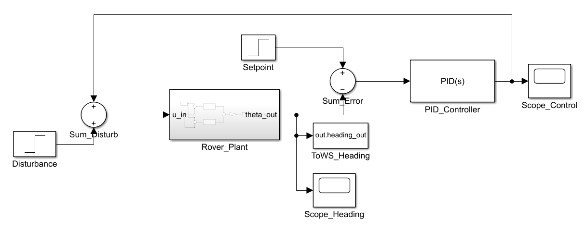
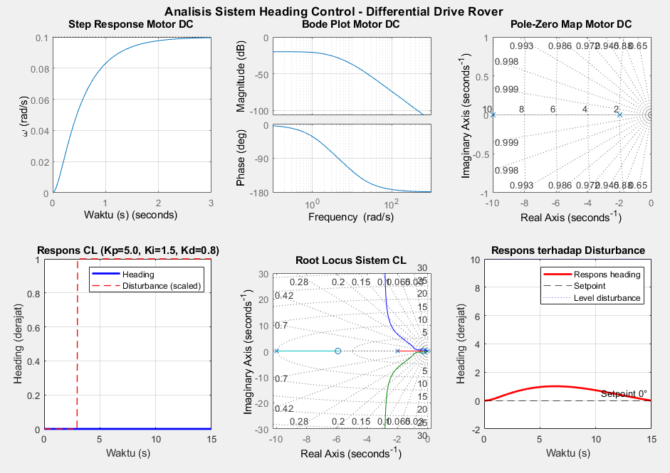

# Heading Control - Differential Drive Rover
Simulasi sistem **Heading Control** untuk robot **Differential Drive Rover** menggunakan **MATLAB & Simulink** dengan kontrol **PID Controller**.
Project ini dibuat untuk praktikum **Teknik Kendali dan Otomasi** Universitas Diponegoro.

---

## 📌 Deskripsi Project
Sistem ini mensimulasikan pengendalian arah (*heading control*) pada robot differential drive menggunakan:
- Model motor DC berbasis transfer function
- Kontrol PID
- Kinematika differential drive
- Simulasi disturbance/gangguan
- Auto-generate model Simulink menggunakan script MATLAB

Script akan otomatis:
- Membuat model Simulink
- Menyusun diagram blok
- Menghubungkan seluruh subsystem
- Menampilkan analisis sistem
- Menyimpan file `.slx`

---

## ⚙️ Fitur
✅ Auto-generate model Simulink  
✅ PID Controller untuk heading stabilization  
✅ Simulasi disturbance pada heading  
✅ Analisis:
- Step Response
- Bode Plot
- Root Locus
- Pole-Zero Map
- Closed-loop Response

✅ Scope monitoring di Simulink  
✅ Export data heading ke Workspace MATLAB  

---

## 🧠 Sistem yang Digunakan
### Differential Drive Rover
Robot menggunakan:
- 2 roda penggerak independen
- Motor kiri dan kanan
- Kontrol heading berbasis perbedaan kecepatan roda

---

## 📐 Model Motor DC
Transfer Function:
```math
G(s) = \frac{K}{(Js+b)(Ls+R)+K^2}
```

---

## 🔧 Diagram Blok Simulink

Berikut adalah diagram blok sistem *Heading Control* yang diimplementasikan pada Simulink, terdiri dari blok Disturbance, Rover_Plant, PID Controller, dan jalur umpan balik:



---

## 📊 Hasil Analisis Sistem

Berikut adalah hasil analisis lengkap sistem, mencakup Step Response Motor DC, Bode Plot, Pole-Zero Map, Respons Closed-Loop (Kp=5.0, Ki=1.5, Kd=0.8), Root Locus, dan Respons terhadap Disturbance:



---
